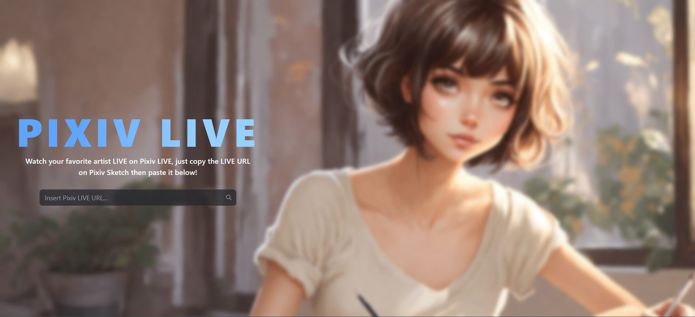
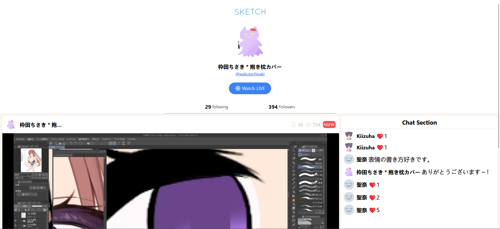
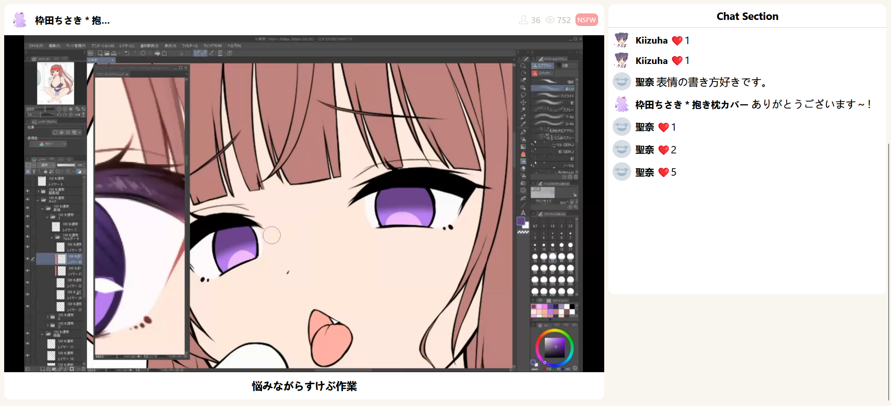

<h1 align="center">pixiv-sketch-svelte</h1>
<p>A simple Pixiv LIVE Sketch made with Sveltekit.</p>

| <h3 align="center">Home Page</h3>          |
| ------------------------------------------ |
|   |

| <h3 align="center">Profile Section</h3>     |
| ------------------------------------------- |
|  |

| <h3 align="center">LIVE Section</h3>     |
| ---------------------------------------- |
|  |

### How to use
```sh
git clone https://github.com/rushkii/pixiv-sketch-svelte.git rushkii/pixiv-sketch-svelte
cd rushkii/pixiv-sketch-svelte
yarn install
yarn dev
# or if you want to expose to your local IP address
yarn dev --host
```

Tested on Firefox `116.0.3` (64-bit) and works fine.

### LICENSE
[MIT License](LICENSE)
